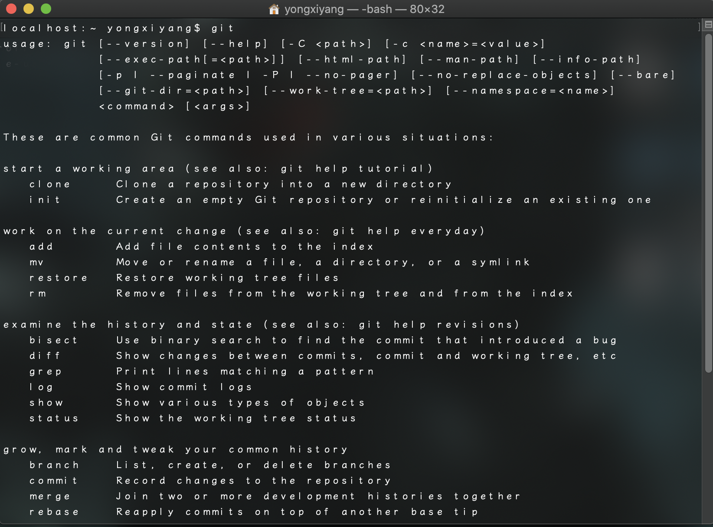
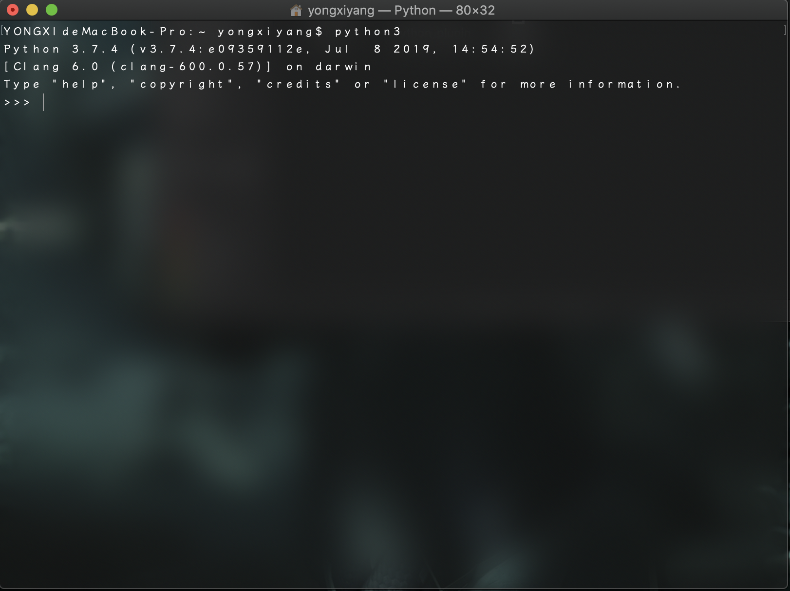
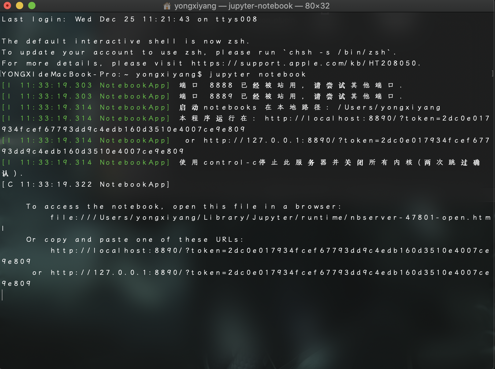
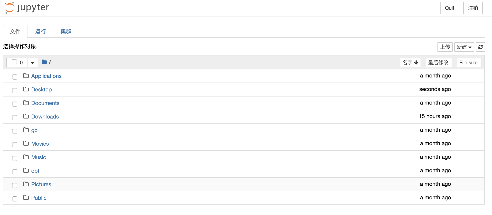
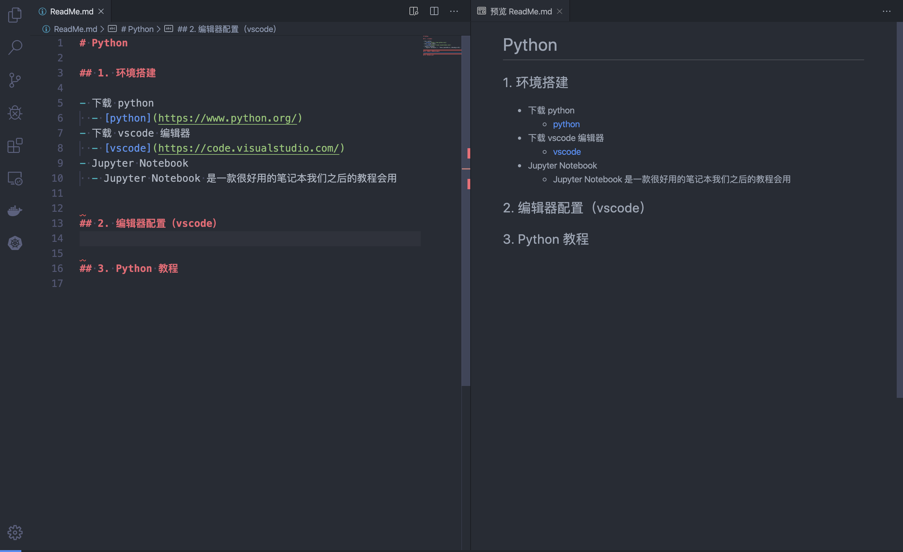
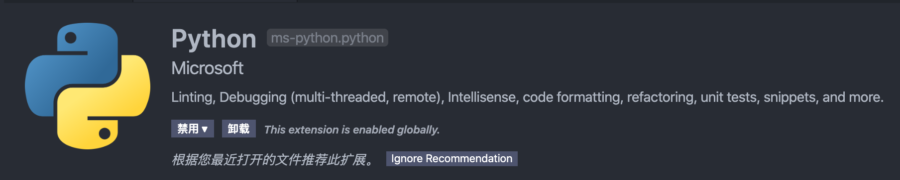

# Python

## 1. 环境搭建

# 亲爱的小甜瓜er 注意啦

# 下面开讲。。。啥？打开

- 下载 python
  - [python](https://www.python.org/)

- 下载 vscode 编辑器
  - [vscode](https://code.visualstudio.com/)

- pip 安装器
  - pip 是一个python 自带的 安装器 python 之中 最有魅力的就是包多
  - 简单的pip 命令

    ```shell
    pip install $(package) #安装 python 的包
    python -m pip install $(package)
    pip install -U $(package) --user #更新 python 包
    python -m pip install -U $(package)
    pip uninstall $(package) # 卸载 python 包
    python -m pip uninstall $(package)
    ```

- git 安装
  - [git](https://git-scm.com/)
  - 测试
  

- 环境测试
  - 打开终端
    - windows(Powershell)
      - 运行 搜索 powershell
    - Mac
      - 按下command + space 搜索 terminal
  - 在终端输入python
    

- Jupyter Notebook
  - Jupyter Notebook 是一款很好用的笔记本我们之后的教程会用
  - 安装 Jupyter NoteBook 用 pip
    - Mac

    ```shell
    python3 -m pip install jupyter
    ```

    - Windows

    ```shell
    python -m pip install jupyter
    ```

  - 测试Jupyter
    - 在终端输入

      ```shell
      jupyter notebook
      ```

    - Jupyter 后台运行结果
    
    - Jupyter 界面
    

## 2. 编辑器配置(vscode)

- 编辑器界面
  
- 边栏
  - 从此向下
  - 文件
  - 搜索
  - 源代码版本控制
  - 调试
  - 插件
  - 
- 安装python插件
  - microsoft python 安装推荐插件
  

## 3. Python 教程

- 打开终端跳到文件夹， 例如桌面

  ```shell
  $git clone https://github.com/Alwaysproblem/python-tutorial.git

  $cd python-tutorial/
  ```

- 运行 .py 文件

  ```shell
  $python love.py
  ```

- 运行 jupyter python 教程

  ```shell
  $jupyter notebook
  ```


<!-- tmp -->
## python 有 许多 运算符

- 数学运算符

  |  加   |  减   |  乘   |  除   | 整除  | 求余  |  幂   |
  | :---: | :---: | :---: | :---: | :---: | :---: | :---: |
  |   +   |   -   |   *   |   /   |  //   |   %   |  **   |

- 比较运算符

  | 等于  | 不等于 | 大于  | 小于  | 小于等于 | 大于等于 |
  | :---: | :----: | :---: | :---: | :------: | :------: |
  |  ==   |   !=   |   >   |   <   |    <=    |    >=    |